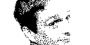

# Sub-Projekt: JpgToBmp

## Anforderung

Ich möchte mit der Kamera (ArduCAM Mini 2MP Plus OV2640) ein Jpg aufnehmen. Der ESP32 DevKitC V2 soll das Bild in ein Byte-Array umwandeln, so dass es auf dem 1.3 Zoll OLED Display SSH1106 angezeigt werden kann.
Das Display hat 128x64 Pixel, ist monochrom, 1 Bit pro Pixel.

### Grundsätzliche Konzeption: Die Daten-Pipeline

Der Kern des Problems ist die Umwandlung (Transformation) von Daten. Wir müssen eine Kette von Verarbeitungsschritten aufbauen, eine sogenannte Pipeline. Diese sieht konzeptionell so aus:

**Quelle (JPG) -> [ Schritt 1 ] -> [ Schritt 2 ] -> [ Schritt 3 ] -> [ Schritt 4 ] -> Ziel (Display)**

1.  **Quelle:** Ein JPG-Datenstrom, der entweder von der `ArduCam`-Klasse oder der `MicroSDCard`-Klasse geliefert wird.
2.  **Schritt 1: JPG-Dekompression:** Die JPG-Daten sind komprimiert. Der erste Schritt muss sein, sie zu dekomprimieren, um an die rohen Pixelinformationen (Farbe für jeden einzelnen Bildpunkt) zu gelangen.
3.  **Schritt 2: Skalierung & Graustufen:** Das dekomprimierte Bild ist riesig (z.B. 1600x1200) und farbig. Wir müssen es auf die Größe des Zieldisplays (z.B. 128x64) herunterskalieren und die Farbinformationen in einen einzigen Graustufenwert pro Pixel umwandeln.
4.  **Schritt 3: Dithering (Monochrom-Umwandlung):** Jetzt haben wir ein kleines Graustufenbild. Da unser Display aber nur "An" (weiß) oder "Aus" (schwarz) kennt, müssen wir entscheiden, welcher Grauwert schwarz und welcher weiß wird. Ein einfacher Schwellenwert würde zu hässlichen, detailarmen Bildern führen. Ein **Dithering-Algorithmus** ist hier die Lösung, um die Illusion von Grautönen zu erzeugen und die Bildqualität drastisch zu verbessern.
5.  **Schritt 4: Bitmap-Formatierung:** Das Ergebnis aus Schritt 3 ist eine 1-Bit-Information (schwarz/weiß) pro Pixel. Diese müssen wir in ein Byte-Array packen, und zwar genau in dem Format, das unsere Display-Bibliothek (`U8g2`) versteht (typischerweise das XBM-Format).
6.  **Ziel:** Der Display-Puffer unserer `OLEDDisplaySH1106`-Klasse, der dann auf dem Bildschirm angezeigt wird.

---

### Wichtige Überlegungen und Stolpersteine (Was ist zu beachten?)

#### 1. JPG-Dekompression (Die größte Hürde)

*   **Wie funktioniert es?** JPG ist ein komplexes, verlustbehaftetes Kompressionsformat. Einen eigenen Decoder zu schreiben, ist ein Projekt für sich. Wir brauchen zwingend eine **externe Bibliothek**.
*   **Welches Werkzeug?** Die mit Abstand beste und etablierteste Bibliothek für Mikrocontroller ist **`TJpgDec` (Tiny JPEG Decompressor)**. Sie ist für genau diesen Zweck geschrieben: ressourcenschonend auf Systemen mit wenig RAM zu laufen.
*   **Was ist zu beachten?** Wir müssen diese Bibliothek in unser PlatformIO-Projekt einbinden.

#### 2. Arbeitsspeicher (RAM) - Die wichtigste Ressource

*   **Das Problem:** Ein dekomprimiertes Farbbild, selbst wenn es klein ist, sprengt schnell den RAM eines ESP32. Ein Bild mit 320x240 Pixeln in Farbe (RGB, 3 Bytes/Pixel) belegt bereits `320 * 240 * 3 = 230.400 Bytes` (~225 KB). Das ist fast die Hälfte des verfügbaren RAMs und lässt kaum Platz für den Rest des Programms. Ein 1600x1200 Bild ist völlig unmöglich.
*   **Die Lösung:** Die `TJpgDec`-Bibliothek ist genial konzipiert. Sie lädt **nie das ganze Bild in den RAM**. Stattdessen arbeitet sie in kleinen Blöcken (sog. MCUs, oft 8x8 oder 16x16 Pixel). Sie dekomprimiert einen Block, ruft dann eine von uns definierte **Callback-Funktion** auf und übergibt uns nur die Pixeldaten dieses kleinen Blocks. In dieser Callback-Funktion führen wir dann unsere Schritte 2-4 (Skalierung, Dithering, Formatierung) durch, bevor der Decoder den nächsten Block liest.
*   **Was ist zu beachten?** Unser gesamter Konvertierungsprozess muss innerhalb dieser Callback-Funktion stattfinden, um den RAM-Verbrauch minimal zu halten.

#### 3. Prozessorlast (CPU) - Die Frage der Geschwindigkeit

*   **Das Problem:** JPG-Dekompression und Dithering sind rechenintensiv. Der ESP32 ist zwar schnell, aber man sollte keine Wunder erwarten.

*   **Die Lösung:** Wir müssen die Erwartungen richtig setzen. Das wird **kein Live-Video-Stream** auf dem OLED sein. Die Konvertierung eines hochauflösenden Fotos wird einige Sekunden dauern. Für die Anzeige von Standbildern ist das aber völlig akzeptabel.

*   **Optimierung:** `TJpgDec` hat eine fantastische Funktion: Es kann das Bild schon **während des Dekomprimierens herunterskalieren** (um den Faktor 2, 4 oder 8). Wenn wir ein 640x480 Bild auf ca. 128x96 (Faktor 5) bringen wollen, können wir es direkt auf 1/4 der Größe (160x120) dekomprimieren lassen. Das spart 93% der Rechenzeit und des Speichers! Das ist der wichtigste Performance-Trick.

#### 4. Dithering (Der Qualitäts-Booster)

*   **Das Problem:** Wenn wir einen Grauwert von 100 (auf einer Skala von 0-255) haben, ist er schwarz oder weiß? Wenn wir einfach sagen "alles unter 128 ist schwarz, alles darüber weiß", verlieren wir alle Details in dunklen und hellen Bereichen. Das Bild sieht aus wie ein Scherenschnitt.

*   **Die Lösung:** Ein Dithering-Algorithmus wie **Floyd-Steinberg**. Er macht Folgendes:
    1.  Er nimmt den Grauwert des aktuellen Pixels (z.B. 100).
    2.  Er entscheidet: "Das ist näher an schwarz (0) als an weiß (255)". Er setzt das Pixel also auf schwarz.
    3.  Er berechnet den "Fehler", den er gemacht hat: `100 - 0 = 100`.
    4.  Diesen Fehler verteilt er anteilig auf die benachbarten Pixel, die noch nicht verarbeitet wurden. Das nächste Pixel, das vielleicht einen Grauwert von 150 hatte, wird dadurch auf z.B. 180 angehoben und hat eine höhere Chance, weiß zu werden.

*   **Ergebnis:** Es entsteht eine Punktwolke, die für das menschliche Auge die Illusion von Grautönen erzeugt. Die Bildqualität ist um Welten besser.

*   **Was ist zu beachten?** Wir müssen eine Implementierung des Floyd-Steinberg-Algorithmus in unsere Callback-Funktion integrieren.

### Schritte zur Umsetzung (Proof Of Concept)

1.  **PoC Schritt 1 (Eigenes JPG als Byte-Array anzeigen):**
Wir stellen den Code zusammen, um ein Bitmap auf dem Display anzeigen zu können. Wir nehmen dann ein JPG-Bild und konvertieren es mit eine einem Online-Tool zum Bitmap (XBM-Format). 

=> Als Bild hab ich mein Portrait gewählt, es mit GIMP auf 128x64 Pixel verkleinert und als JPG gespeichert:

Das JPG-Bild hab ich dann dem Tool [Online Image Converter to XBM](https://www.online-utility.org/image/convert/to/XBM) konvertiert:

2.  **PoC Schritt 2 (Eigene Konverter-Funktion):**
Hier implementieren wir die Kernlogik (TJpgDec, Skalierung, Dithering) und vergleichen das Ergebnis mit dem aus Schritt 1.

3.  **PoC Schritt 4 (Stream-Verarbeitung):**
Hier abstrahieren wir die Funktion, sodass sie nicht mehr von einer festen Datei abhängt, sondern jeden beliebigen Datenstrom verarbeiten kann.